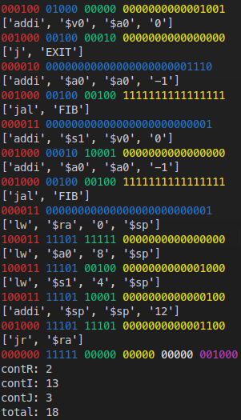

# Simple Assembler to MIPS32bits

Very simple version of an Assembler to binary code.

Use mode: 

    python compiler.py mips.txt asm.txt

## MIPS input

    # Fibonacci code
    FIB:    addi $sp, $sp, -12
            sw $ra, 0($sp)
            sw $s1, 4($sp)
            sw $a0, 8($sp) # comment
            slti $t0, $a0, 1
            beq $t0, $0, L1
            addi $v0, $a0, 0
            j EXIT
    L1:     addi $a0, $a0, -1
            jal FIB
            addi $s1, $v0, 0 # comment
            addi $a0, $a0, -1
            jal FIB
    EXIT:   lw $ra, 0($sp)
            lw $a0, 8($sp)
            lw $s1, 4($sp)
            addi $sp, $sp, 12
            jr $ra

## Binary output

    00100011101111011111111111110100
    10101111101111110000000000000000
    10101111101100010000000000000100
    10101111101001000000000000001000
    00101000100010000000000000000001
    00010001000000000000000000001001
    00100000100000100000000000000000
    00001000000000000000000000001110
    00100000100001001111111111111111
    00001100000000000000000000000001
    00100000010100010000000000000000
    00100000100001001111111111111111
    00001100000000000000000000000001
    10001111101111110000000000000000
    10001111101001000000000000001000
    10001111101100010000000000000100
    00100011101111010000000000001100
    00000011111000000000000000001000

### Sources
- [MIPS® Architecture For ProgrammersVolume II-A: The MIPS32® InstructionSet](https://s3-eu-west-1.amazonaws.com/downloads-mips/documents/MD00086-2B-MIPS32BIS-AFP-05.04.pdf).
- [MIPS converter](https://www.eg.bucknell.edu/~csci320/mips_web/)

## Output print example

